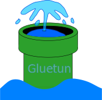
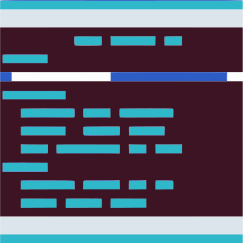
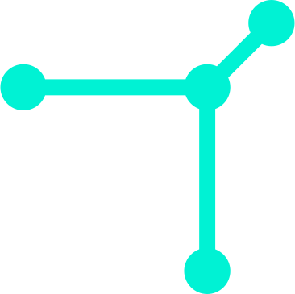

# Home Infrastructure as Code

A reference repository showcasing how I like to manage my home lab infrastructure — treating personal infra with the same rigor you'd expect in a production environment. Everything is versioned, automated where it makes sense, and documented properly.

**What's here:**

- `stacks/` — Docker Compose stacks deployed via Portainer
- `terraform/` — Infrastructure as Code modules for various providers
- `docs/` — ADRs, golden paths, runbooks, playbooks, and architecture diagrams

---

## At a Glance

| Layer | What | Tools |
|-------|------|-------|
| **Compute** | Proxmox VE hosts running LXC containers | OpenTofu (`terraform/proxmox/`) |
| **Containers** | Docker stacks managed via Portainer | Compose files in `stacks/` |
| **Networking** | MikroTik RouterOS config | OpenTofu (`terraform/routeros/`) |
| **Edge** | Traefik reverse proxy + CrowdSec | `stacks/traefik/` |
| **Identity** | Authentik (OAuth, SAML, LDAP) | `stacks/authentik/` + OpenTofu (`terraform/authentik/`) |
| **Inventory** | NetBox for IPAM/DCIM | `stacks/netbox/` + OpenTofu (`terraform/netbox/`) |
| **Secrets** | HashiCorp Vault + Vaultwarden | `stacks/vault/`, `stacks/vaultwarden/` |
| **Monitoring** | Gatus, Grafana Synthetic Agent | `stacks/gatus/`, `stacks/grafana-synthetic-agent/` |
| **Media** | Jellyfin + *arr stack + downloaders | `stacks/mediabox/` |

📖 **[Full documentation](docs/index.md)** — ADRs, golden paths, runbooks, playbooks, and C4 architecture diagrams.

---

## NetBox: Source of Truth

[NetBox](https://github.com/netbox-community/netbox) serves as the single source of truth for infrastructure inventory:

- **What it tracks**: Sites, devices, device types, manufacturers, IP addresses, prefixes, VLANs, tags
- **How it fits**: The `terraform/netbox/` module manages NetBox objects as code, keeping the inventory in sync with reality
- **Access**: Internal only — `https://netbox.your-domain.local` (placeholder)

The OpenTofu module (`terraform/netbox/`) defines:
- Device roles and types
- Manufacturers
- Sites and locations
- IP prefixes and addresses
- Tags for organization

---

## Services

| Icon | Service | Purpose |
|------|---------|----------|
|  | [AdGuard Home](https://github.com/AdguardTeam/AdGuardHome) | Network-wide DNS + adblocking |
|  | [Authentik](https://github.com/goauthentik/authentik) | Identity & Access Management (OAuth, SAML, LDAP) |
|  | [Bazarr](https://github.com/morpheus65535/bazarr) | Subtitle automation |
|  | [Calibre](https://github.com/kovidgoyal/calibre) | eBook management & library |
|  | [Cloudflared](https://github.com/cloudflare/cloudflared) | Tunnel to Cloudflare for remote access |
|  | [CUPS](https://github.com/OpenPrinting/cups) | Print server |
|  | [DIUN](https://github.com/crazy-max/diun) | Docker image update notifications |
|  | [Dozzle](https://github.com/amir20/dozzle) | Docker container log viewer |
|  | [FlareSolverr](https://github.com/FlareSolverr/FlareSolverr) | Cloudflare bypass for indexers |
|  | [Firefly III](https://github.com/firefly-iii/firefly-iii) | Personal finance manager |
|  | [Gitea](https://github.com/go-gitea/gitea) | Self-hosted Git |
|  | [Gluetun](https://github.com/qdm12/gluetun) | VPN gateway for "download stuff" apps |
|  | [Home Assistant Time Machine](https://github.com/saihgupr/homeassistanttimemachine) | Web UI for Home Assistant / ESPHome config backups (`stacks/hass/`) |
|  | [Grafana Synthetic Agent](https://github.com/grafana/synthetic-monitoring-agent) | Uptime & performance monitoring |
|  | [Jellyfin](https://github.com/jellyfin/jellyfin) | Media server |
|  | [Seerr](https://github.com/seerr-team/seerr) (formerly Jellyseerr; Docker image still `fallenbagel/jellyseerr`) | Requests / discovery for Jellyfin |
|  | [n8n](https://github.com/n8n-io/n8n) | Workflow automation platform |
|  | [netboot.xyz](https://github.com/netbootxyz/netboot.xyz) | Network boot environments |
|  | [NetBox](https://github.com/netbox-community/netbox) | Network infrastructure IPAM |
|  | [PostgreSQL](https://github.com/postgres/postgres) | Database server |
|  | [Prowlarr](https://github.com/Prowlarr/Prowlarr) | Indexer manager |
|  | [qBittorrent](https://github.com/qbittorrent/qBittorrent) | Torrent client (routed via VPN) |
|  | [Radarr](https://github.com/Radarr/Radarr) | Movie automation |
|  | [SABnzbd](https://github.com/sabnzbd/sabnzbd) | Usenet downloader (routed via VPN) |
|  | [Sonarr](https://github.com/Sonarr/Sonarr) | TV automation |
|  | [Stalwart Mail](https://github.com/stalwartlabs/stalwart) | Send-only SMTP server for app notifications |
|  | [Traefik](https://github.com/traefik/traefik) | Reverse proxy with CrowdSec security integration |
|  | [Upsnap](https://github.com/seriousm4x/UpSnap) | Wake-on-LAN management |
|  | [Gatus](https://github.com/TwiN/gatus) | Uptime monitoring & status page |
|  | [Vault](https://github.com/hashicorp/vault) | Secrets management |
|  | [Vaultwarden](https://github.com/dani-garcia/vaultwarden) | Password manager server (Bitwarden compatible) |
|  | [Warracker](https://github.com/sassanix/warracker) | Warranty & asset tracking |
|  | [watchyourlan](https://github.com/aceberg/watchyourlan) | LAN device discovery & monitoring |

---

## Infrastructure Overview

### Network

- **ISP**: INEA (Poland) — 300Mb/s synchronous FTTH
- **Router**: MikroTik hAP ac3
- **Wireless**: TP-Link Deco M4R x3 (mesh)
- **Remote Access**: Public IP with WireGuard / ngrok (backup)

**IP Allocation:**

| Range | Purpose |
|-------|---------|
| `.0–.9` | Network devices |
| `.10–.99` | Static IPs |
| `.100–.199` | DHCP pool |
| `.200–.254` | Homelab interfaces |

DHCP + NTP handled via RouterOS.

### Compute

- **Main Server (lake-1)**: Mini PC FIREBAT T8 Pro Plus — Intel N100, 16GB DDR5, 512GB SSD
  - Runs Proxmox VE
  - Hosts containers and VMs
- **Secondary Server (edge-1)**: Dell PowerEdge R610 (experimental)
  - Runs Proxmox VE
  - Mostly off, sometimes runs a Minecraft server for my brother

**LXC Containers on Proxmox:**

- Docker (Portainer host)
- AdGuard
- HomeAssistant

### Storage

- **NAS**: Synology DS220+ with 2 × 4TB disks
  - Primary storage + backups

### Client Devices

- Apple ecosystem (MacBook, iPhone, iPad, etc.)
- Android devices
- eBook readers (Kobo/Kindle)
- PCs with Windows 11/Fedora
- Samsung TVs
- Raspberry Pi (SDR Radio, 3D Printers)
- Printers: Sharp MX-4071, OKI ES5461

---

## How to Use This Repo

### OpenTofu Workflow

Each OpenTofu module under `terraform/` has a `Makefile` with standard targets:

```bash
cd terraform/<module>
make init      # Initialize OpenTofu
make plan      # Preview changes
make apply     # Apply changes (auto-approve)
make destroy   # Tear down (auto-approve)
make validate  # Validate configuration
make fmt       # Format files
make check     # Run validate + fmt
make clean     # Remove .terraform/ and lock files
```

Some modules have extra targets (e.g., `terraform/portainer/` has `sync-portainer` to rsync stacks to the host).

### Docker Stacks Workflow

Stacks live in `stacks/<service>/` with:

- `compose.yaml` — the Docker Compose file
- `*.env.example` — example environment variables (copy to `*.env` and fill in secrets)
- Optional config files (e.g., `traefik.yaml`, `dynamic.yaml`)

**To deploy a stack:**

1. Copy `*.env.example` to `*.env` and fill in secrets
2. Either:
   - Use Portainer to deploy the stack, or
   - Run `docker compose up -d` directly on the host

The `terraform/portainer/` module handles syncing stacks to the Portainer host via rsync.

### Secrets Handling

- **`.env.example` files**: Committed to the repo — contain structure and placeholder values
- **`.env` files**: Never committed — contain actual secrets (gitignored)
- **Sensitive Terraform variables**: Stored in `defaults.auto.tfvars` or passed via environment

---

## Repository Structure

```
├── docs/                           # Documentation
│   ├── index.md                    # Docs portal
│   ├── adr/                        # Architecture Decision Records
│   ├── golden-paths/               # How-to guides for common tasks
│   ├── runbooks/                   # Incident response procedures
│   ├── playbooks/                  # Repeatable operational tasks
│   ├── architecture/               # C4 diagrams and system overviews
│   └── assets/                     # Icons and images
│
├── stacks/                         # Docker Compose stacks
│   ├── adguard/
│   ├── authentik/
│   ├── calibre/
│   ├── cups/
│   ├── cloudflared/
│   ├── diun/
│   ├── dozzle/
│   ├── gitea/
│   ├── grafana-synthetic-agent/
│   ├── hass/
│   ├── mediabox/
│   ├── n8n/
│   ├── netbootxyz/
│   ├── netbox/
│   ├── postgres/
│   ├── traefik/
│   ├── upsnap/
│   ├── gatus/
│   ├── vault/
│   ├── vaultwarden/
│   ├── warracker/
│   └── watchyourlan/
│
├── terraform/                      # Infrastructure as Code
│   ├── authentik/
│   ├── backblaze/
│   ├── gcp/
│   ├── netbox/
│   ├── portainer/
│   ├── proxmox/
│   ├── routeros/
│   ├── synology-nas/
│   ├── vault/
│   └── terraform-cloud/
│
├── mkdocs.yml                      # MkDocs configuration
└── README.md
```

---

## Roadmap

- [ ] Migrate cloud drives to NAS
- [ ] Migrate backups from Proxmox to NAS
- [x] Use Authentik LDAP for Synology
- [ ] Add NUT/UPS integration
- [ ] k3s single-node cluster
- [ ] Self-hosted LLM (Ollama)
- [ ] Separated subnets (IoT isolation)
- [ ] Use Terraform for RouterOS management (or via NetBox)?

---

## Changelog

### 12.04.2026

**Gitea** stopped living on a Docker named volume — `/data` is bind-mounted to the NAS (same energy as the mediabox NFS pattern), and Traefik gets `traefik.docker.network: proxy` so it doesn’t pick the wrong attach point. **`gitea.env.example`** now spells out the Authentik OIDC callback / source-name footguns so I don’t rediscover them at 2am.

**Home Assistant** stack grew **HA Time Machine** (`ghcr.io/saihgupr/homeassistanttimemachine`): Traefik + Authentik at `timemachine.lake.dominiksiejak.pl`, secrets via `/opt/hass/timemachine.env` with `stacks/hass/timemachine.env.example` as the template, exports landing under `/opt/hass/timemachine` on the host.

**NetBox** Compose image bumped to **v2.5.13**; Terraform **netbox** provider lock moved with it.

**Authentik** Terraform: **Firefly III** and **WatchYourLAN** are real forward-auth proxy apps now (WatchYourLAN got yeeted off the dashboard-only list). **`all_app_uuids`** uses `setintersection` against resources in state so renamed/missing apps don’t brick evaluation. Dropped a stale `import` block on the embedded proxy outpost.

Regenerated **`.terraform.lock.hcl`** files across modules so they also record **`registry.terraform.io/*`** provider hashes — `terraform init` stops whining even when I’m not living purely in OpenTofu-land.

More **12.04** tweaks after that landed: **Postgres** is **localhost-only** on the host (`127.0.0.1:5432`) so random LAN clients can’t poke the DB; **`terraform/postgres/Makefile`** now knows **`POSTGRES_SSH_TARGET`** and spins an SSH **`-L`** tunnel for **`tofu plan`/`apply`** from a dev machine when you’re not on the Portainer box (sets **`TF_VAR_postgres_host`** / **`TF_VAR_postgres_port`** for the run). **Vault** no longer publishes **`8200`** on the host — it’s **Traefik-or-bust**, which is the whole point of the proxy stack.

**Traefik** got **`host.docker.internal:host-gateway`** so file-provider / container routers can hit **host-networked** **Home Assistant** and **ESPHome** without hard-coding a DHCP address. **HASS stack**: **Mosquitto** has a **`mosquitto_sub`** healthcheck, **HA** + **zigbee2mqtt** **`depends_on`** with **`condition: service_healthy`**, **HA Time Machine** is gated behind compose **`profile: timemachine`** (set **`COMPOSE_PROFILES=timemachine`** in Portainer or your shell when you want it; **`timemachine.env.example`** documents that). **zigbee2mqtt** config sets **`frontend.url`** to the Traefik hostname so links don’t lie.

**Authentik** compose: **`AUTHENTIK_LOG_LEVEL`** back to **`info`**, **Docker socket** mounted **`:ro`** (same **`:ro`** treatment for **Dozzle**). **Authentik** Terraform adds **`zigbee2mqtt`** to the user-facing app list; the module lockfile is **OpenTofu-only** now — yeeted the duplicate **`registry.terraform.io/*`** stanzas.

### 6.04.2026

Swapped **Terraform Cloud** remote state for a **GCS** bucket — wired backends across the Terraform roots, added a batch **TFC→GCS** migration script plus `migrate-all-tfc` / `bootstrap-tfstate-bucket` make targets so I’m not clicking through fifty workspaces. On the **Proxmox** side: **Talos** cluster resources, optional **Calico** bootstrap after kubeconfig lands, and gitignored `terraform/proxmox/generated/` for Talos/kubeconfig artifacts.

Pushed more **Kubernetes** platform bits: **Grafana**, **VictoriaMetrics**, **Vector**, **Stakater Reloader**, **Calico**, **Grafana Alloy** (incl. templates), plus **homelab** manifests and ArgoCD / **n8n** tweaks. Pruned legacy **Docker Compose** stacks from `stacks/` (AdGuard, CyberChef, Firefly, OmniTools, Watchtower) since those workloads moved to the cluster, trimmed **Gatus**, and refreshed **NetBox** IPAM data + **MkDocs** networking notes.

### 5.04.2026

Renamed the Seerr bits in docs (Jellyseerr is legacy branding; Docker image name unchanged). Fixed the Authentik `user_accessible_apps` slug to match `seerr`, pointed the Gitea mirror at the new GitHub repo, and added a Talos DHCP reminder so apply doesn’t look like it’s hanging forever.

### 4.04.2026

OpenTofu + provider refresh, pinned a few container images, fixed CI’s tofu pin (it was embarrassingly old). Threw a note on Seerr about OIDC still being preview-only upstream.

### 7.03.2026

Updated all dependencies to latest versions — Docker images, Terraform providers, and OpenTofu itself.

### 05.02.2026

Added a new `smtp` stack running Stalwart SMTP server for send-only notifications. It's exposed publicly on ports 587/465 with SMTP AUTH required, so apps can connect from anywhere without turning into an open relay. Admin UI is behind Traefik at `smtp.lake.dominiksiejak.pl`. Planning to relay outbound through Zoho since my dynamic IP would tank deliverability otherwise.

### 03.02.2026

Brought back Watchtower as a Portainer-managed stack (using the maintained `ghcr.io/containrrr/watchtower` image, not the abandoned one). Also removed the leftover `wud.*` label from the Postgres stack since I don’t want WUD poking at DB/Vault-tier stuff.

Also bumped the centralized Postgres stack to **v18** and added a safe `17 -> 18` migration script (logical dump + filesystem snapshot + restore into a fresh v18 data dir) so I can roll forward/back without sweating data loss.

### 02.02.2026

Swapped Uptime Kuma for Gatus as the uptime monitoring solution. Gatus is simpler, uses config-as-code (YAML), and doesn't need a database - just SQLite for history. Migrated all monitors from Terraform to the Gatus config file. Removed the whole `terraform/uptime-kuma/` module and the Terraform Cloud workspace for it. Updated Authentik, Vault, and Postgres configs to drop the Uptime Kuma references. Status page now lives at `status.lake.dominiksiejak.pl`.

### 11.01.2026

Swapped the Terraform CLI for OpenTofu (`tofu`) across the repo. All module `Makefile`s now run `tofu`, pre-commit uses the OpenTofu hooks, CI installs OpenTofu. Vault now manages all OAuth secrets (for example, Authentik's client secrets), so there is no longer any global tfstate access for Authentik. Secrets are injected at runtime via Vault instead of being stored in shared state.

### 16.12.2025

README cleanup: the "Apps on Portainer" table now actually lists everything that's sitting in `stacks/` (adguard/keycloak/openldap included). Also expanded the whole mediabox setup into the individual apps (Jellyfin, *arrs, downloaders, VPN gateway), so it's not a mystery box anymore. Pulled proper icons into `docs/assets/` for the mediabox apps too (incl. FlareSolverr) — README is now local-images-only.

### 15.12.2025

Ripped out ZITADEL and went back to Authentik after realizing it was just causing more headaches than it was worth. Re-added Authentik service with full Docker Compose setup, updated PostgreSQL config to handle Authentik DB creds properly, and cleaned up all the ZITADEL cruft from Terraform. Also added Diun for Docker image update notifications. Basically reverting back to what was working before.

### 23.11.2025

Wrote up new repo rules for Docker Compose stacks and Terraform/GCP configs, gutted the unused ArgoCD/Cert-Manager/chart cruft, and rewired the mediabox/Traefik/Portainer pieces: Configarr is gone, Vaultwarden got its own stack plus DB creds, and Terraform-side references now match the fresh stack layout. Lost some commits while switching PCs before I could push them (the HDD format nuked the old machine), so this is the history that actually made it up here.

### 23.08.2025

Swapped Authentik with ZITADEL due to ongoing configuration issues. Despite limited documentation for ZITADEL, it's an actively growing project with promising potential.

### 22.08.2025

Switched back from Podman to Docker due to too many compatibility issues. Docker has better ecosystem support and fewer configuration headaches.

### 20.08.2025

Upgraded hardware by replacing old wally-1 terminal with new lake-1 server (Mini PC FIREBAT T8 Pro Plus Intel N100 16GB DDR5 / 512GB) for better performance. Also migrated domain from wally.dominiksiejak.pl to lake.dominiksiejak.pl, updating 25+ configuration files across Docker stacks, Helm charts, and Terraform modules. Updated all Traefik routing, SSL certificates, DNS, and service URLs.

### 31.07.2025

Major infrastructure improvements: added n8n for workflow automation, PostgreSQL for database storage, and Grafana Synthetic Monitoring Agent. Enhanced development tools with pre-commit hooks, GitHub Actions, and improved CI/CD pipeline. Improved Traefik routing and security, updated Docker images, added healthchecks. Removed mktxp stack and .cursorrules file. Updated various configurations and documentation.

### 7.07.2025

Replaced Nginx Proxy Manager with Traefik as the reverse proxy and added CrowdSec security integration. Added mediabox stack for home media server setup. Removed VictoriaMetrics stack since moving to Grafana Cloud. Updated all stack configurations to use Traefik labels.

### 25.05.2025

Refactored the Terraform code slightly to reduce repetition. I also removed 'watchtower' — it's a great tool, but I prefer to update everything manually, and RenovateBot will handle the rest.

### 21.05.2025

I have configured the Google SSO for Authentik with the terraform. However, I did some changes manually in the UI for the flows/stages, as they're super difficult to configure via terraform.

### 20.05.2025

I have just refactored Portainer stacks, so I won't have to deal with many resources, but have done it all in a single array. Before, I thought it would be better this way, but it wasn't worth it.

### 18.05.2025

I'm reverting from Portainer's GitOps option that was automatically pulling stacks from this repository. The delay between commits and actual changes in Portainer was frustrating. Plus, I couldn't make any temporary changes in stacks. I'd rather execute `terraform apply` to keep everything in one place.

### 17.05.2025

Because I accidentally deleted my authentik environment variables, I decided to give authelia a shot. I've heard only good things about it, and it's fully configurable via YAML files. It seemed promising, but I felt like I was missing some options that worked perfectly out-of-the-box in authentik. I tried to configure it, but ended up restoring authentik from backup anyway.
