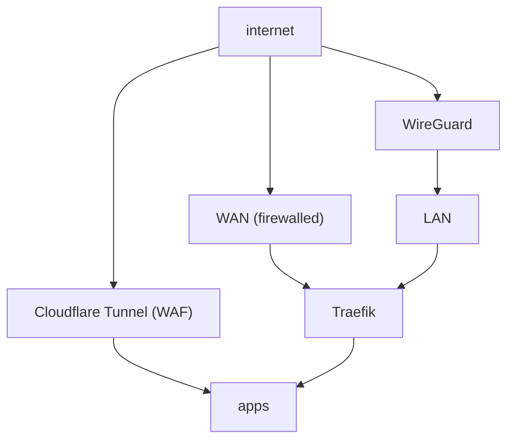

# homelab

<p align="center">
  <strong>one house, one git repo, too many daemons</strong>
</p>

<p align="center">
  kubeadm on a mini PC · Argo CD · OpenTofu · Traefik · Authentik · a NAS that holds everything
</p>

<p align="center">
  <a href="#stack">stack</a> ·
  <a href="#hardware">hardware</a> ·
  <a href="#edge">edge</a> ·
  <a href="#apps">apps</a> ·
  <a href="#layout">layout</a> ·
  <a href="#operating-it">operating it</a> ·
  <a href="#roadmap">roadmap</a> ·
  <a href="CHANGELOG.md">changelog</a>
</p>

---

Public on purpose. Hostnames and the LAN map are not secrets. Credentials, `*.env`, `*.tfvars`, and Cloudflare state are.

Most of the lab runs on a single kubeadm node and is reconciled by Argo CD. OpenTofu owns the things Kubernetes should not: DNS rewrites, the router, Wi-Fi, identity apps, and Grafana Cloud.


```mermaid
flowchart TD
  internet[internet]
  internet --> wan["WAN (firewalled)"]
  internet --> wg[WireGuard]
  internet --> cf["Cloudflare Tunnel (WAF)"]
  wan --> edge[Traefik]
  wg --> lan[LAN]
  lan --> edge
  cf --> apps[apps]
  edge --> apps
```

## 🧰 stack

| layer | what | where |
| --- | --- | --- |
| remote | WireGuard on the router, Tailscale if that path dies | `terraform/routeros/wireguard.tf` |
| compute | Proxmox VE, LXC | lake-1 (always), edge-1 (mostly off) |
| kubernetes | kubeadm, Flannel host-gw, Argo CD | `kubernetes/` |
| edge | Traefik-k8s, CrowdSec, Authentik | `kubernetes/traefik/` |
| identity | Authentik OAuth / SAML / LDAP | `kubernetes/authentik/` + `terraform/authentik/` |
| dns | AdGuard Home → RouterOS → 1.1.1.1 | `kubernetes/adguard/` + `terraform/adguard/` |
| wifi | UniFi U7 Lite, WLANs as code | `kubernetes/unifi/` + `terraform/unifi/` |
| router | MikroTik hAP ac3 | `terraform/routeros/` |
| data | CloudNativePG + NAS | `kubernetes/cloudnative-pg/` |
| secrets | 1Password → External Secrets | `kubernetes/*/resources/externalsecret-*.yaml` |
| monitoring | VictoriaMetrics, Grafana, blackbox | `kubernetes/monitoring/` + `terraform/grafana/` |

## 🖥️ hardware

| box | role | notes |
| --- | --- | --- |
| **lake-1** | always on | 🏠 Mini PC. Proxmox. The Kubernetes node. |
| **vibe** | Mac | 🤖 AI node. |
| **edge-1** | experimental | 🧪 Dell PowerEdge R610. Usually off. |
| **nas** | storage | 💾 Synology DS220+. |

ISP is INEA, 1 Gbps synthetic FTTH. Router is a MikroTik. AP is a UniFi U7 Lite.

Remote access is WireGuard on the router. Tailscale if that path dies.

## 🚪 edge

Three doors. Do not collapse them.

| path | what it is |
| --- | --- |
| **WAN** | 🔥 Public web, firewalled. Allowlist, then Traefik. |
| **WireGuard** | 🔒 VPN onto the LAN. |
| **Cloudflare Tunnel** | ☁️ WAF for some hosts. Separate path. |

Auth class per host is `scripts/auth_classification.yaml`: `forward-auth`, `native-oidc`, `public`, `lan-only`.

## 📦 apps

Argo CD parents everything under `kubernetes/`. A directory with `values.yaml` (`repoURL` / `chart` / `version`) becomes a Helm Application. No `values.yaml` means a hand-written Application in `kubernetes/argocd/resources/`.

| app | job |
| --- | --- |
| [AdGuard Home](https://github.com/AdguardTeam/AdGuardHome) | DNS. |
| [Authentik](https://goauthentik.io/) | Identity. |
| [Argo CD](https://argo-cd.readthedocs.io/) | This repo, applied to itself. |
| [Calibre](https://github.com/kovidgoyal/calibre) | Books. |
| [CloudNativePG](https://cloudnative-pg.io/) | Shared Postgres. |
| [Gitea](https://github.com/go-gitea/gitea) | Git. |
| [Headlamp](https://headlamp.dev/) | Kubernetes UI. Admins only. |
| [Home Assistant](https://www.home-assistant.io/) | Home, MQTT, Zigbee. |
| [Homepage](https://gethomepage.dev/) | The dashboard. |
| [Mediabox](https://jellyfin.org/) | Jellyfin and the *arr stack. Downloads stay on a VPN. |
| [n8n](https://n8n.io/) | Workflows. |
| [NetBox](https://github.com/netbox-community/netbox) | IPAM / DCIM. |
| [Paperclip](https://github.com/paperclipai/paperclip) | Agents. Signup off. |
| [Traefik](https://traefik.io/) | The edge. |
| [UniFi](https://ui.com/software) | Wi-Fi controller. |
| [WatchYourLAN](https://github.com/aceberg/watchyourlan) | Who is on the LAN. |
| [Wealthfolio](https://wealthfolio.app/) | Personal finance. |

Portainer is gone. Apps run on Kubernetes. Databases live on CloudNativePG.

## 🗂️ layout

```
.
├── kubernetes/          Argo CD apps. This is the workload tree.
│   ├── argocd/          self-managed Argo CD + ApplicationSet
│   ├── traefik/         edge
│   ├── flannel/         CNI
│   └── <app>/           one directory per app
├── terraform/           OpenTofu. State in GCS, prefix gitops-<module>.
│   ├── authentik/  adguard/  routeros/  unifi/  cloudflare/
│   ├── grafana/  netbox/  gcp/  gitea/  backblaze/
│   └── base.Makefile
├── scripts/             auth_classification.yaml
└── .github/workflows/   manual tofu plan/apply over WireGuard
```

## 🔧 operating it

OpenTofu `1.12.5`. From a module directory:

```bash
cd terraform/<module>
make check     # validate + fmt
make plan
make apply     # -auto-approve
```

Argo CD is the deploy path for `kubernetes/`. Bootstrap (only if Argo itself is down):

```bash
make -C kubernetes/argocd bootstrap
```

Context `k8s@lake`, chart `argo-cd` `10.4.0`. After that, push to `main`.

Secrets:

- Kubernetes: 1Password items, External Secrets. Tag Argo CD items `ArgoCD External Secrets Operator`.
- OpenTofu: gitignored `defaults.auto.tfvars`. Never commit it.

New app data is a static NFS volume on the NAS, pointed at the export that already exists. Do not pin it to one node with a host bind.

## 🗺️ roadmap

- [ ] Cloud drives onto the NAS
- [ ] Proxmox backups onto the NAS
- [x] Authentik LDAP for the Synology
- [ ] NUT / UPS
- [x] kubeadm + self-managed Argo CD
- [x] Argo CD via Authentik OIDC, secrets from 1Password
- [x] Vault, Phase, and Vaultwarden out of the public repo
- [x] UniFi controller + U7 Lite / WLANs as code
- [ ] `terraform/cloudflare` into a private sibling repo
- [ ] Self-hosted LLM
- [ ] Real IoT isolation
- [ ] RouterOS fully driven from this repo (or from NetBox)
- [x] Home Assistant on the lake node
- [x] Helm-only apps drop empty `kustomization.yaml`

---
