# 🏠 Welcome in my Home(Lab)

This repository contains all configuration and documentation for my hobbist
homelab setup.

The goal is to track infrastructure changes, automate as much as possible, and
provide a living reference for improvements. Contributions and suggestions are welcome.

---

## 🌐 Infrastructure Overview

- **Network Provider**: INEA (Poland) 300Mb/s synchronous FTTH

- **Router**: MikroTik hAP ac3

- **Main Server (wally-1)**: Dell Wyse thin client
  - Runs **Proxmox VE**
  - Hosts containers and VMs

- **Secondary Server (edge-1)**: Dell PowerEdge R610 (experimental)
  - Runs **Proxmox VE**
  - Mostly it's turned off, sometimes runs a Minecraft server for my brother

- **NAS**: Synology, 2 × 4TB disks
  - Storage + backups

- **LXC Containers (on Proxmox):**
  - Docker/Portainer
  - Pi-hole (deprecating)
  - AdGuard

- **Apps on Portainer:**
  - [authentik](https://github.com/goauthentik/authentik)
  - [cloudflared](https://github.com/cloudflare/cloudflared)
  - [dozzle](https://github.com/amir20/dozzle)
  - [homarr](https://github.com/ajnart/homarr) (dashboard for homelab services)
  - [netboot.xyz](https://github.com/netbootxyz/netboot.xyz)
  - [Traefik](https://github.com/traefik/traefik) (reverse proxy with CrowdSec security)
  - [Upsnap](https://github.com/seriousm4x/UpSnap)
  - [CUPS](https://github.com/OpenPrinting/cups)
  - [Uptime Kuma](https://github.com/louislam/uptime-kuma)
  - [mktxp](https://github.com/akpw/mktxp)
  - [watchyourlan](https://github.com/aceberg/watchyourlan)
  - [alloy](https://github.com/grafana/alloy) (Grafana Alloy agent for logs/metrics)
  - mediabox (qBittorrent, Sonarr, Radarr, Jellyfin, etc. - media automation stack)
  - [Grafana](https://github.com/grafana/grafana)
  - [Grafana Synthetic Monitoring Agent](https://github.com/grafana/synthetic-monitoring-agent)
    (I'm using Grafana Cloud for synthetic checks)
  - [n8n](https://github.com/n8n-io/n8n) (workflow automation platform)
  - [PostgreSQL](https://github.com/postgres/postgres) (database server)

- **Networking:**
  - IP Ranges:
    - `.0-.9`: network devices
    - `.10-.99`: static IPs
    - `.100-.199`: DHCP
    - `.200-.254`: Homelab interfaces
  - DHCP + NTP handled via RouterOS
  - Remote Access: Tailscale / ngrok (as backup, when accidentally kill tailscale)
  - Wireless: TP-Link Deco x3

- **Client Devices:**
  - Apple ecosystem (MacBook, iPhone, iPad, etc.)
  - Android devices
  - ebook readers (kobo/kindle)
  - PCs with Windows 11/Fedora
  - TVs with Samsung
  - Raspberry Pi
    - SDR Radio
    - 3D Printers
  - Printers:
    - Sharp MX-4071
    - OKI ES5461

---

## 📁 Repository Structure

```
├── /stacks/
│   ├── alloy/                # Grafana Alloy agent
│   ├── authentik/            # Authentik SSO
│   ├── cloudflared/          # Cloudflare Tunnel
│   ├── cups/                 # CUPS print server
│   ├── dozzle/               # Dozzle log viewer
│   ├── grafana-synthetic-agent/ # Grafana Synthetic Monitoring Agent
│   ├── homarr/               # Homarr dashboard for homelab services
│   ├── mediabox/             # Media automation stack (qBittorrent, Sonarr, Radarr, Jellyfin, etc.)
│   ├── mktxp/                # Mikrotik Prometheus exporter
│   ├── n8n/                  # n8n workflow automation platform
│   ├── netbootxyz/           # Netboot.xyz PXE
│   ├── postgres/             # PostgreSQL database server
│   ├── traefik/              # Traefik reverse proxy with CrowdSec security
│   ├── upsnap/               # Upsnap wake-on-LAN
│   ├── uptime_kuma/          # Uptime Kuma monitoring
│   └── watchyourlan/         # WatchYourLAN network scanner
│
├── /terraform/
│   ├── authentik/            # Authentik SSO infra
│   ├── portainer/            # Portainer infra
│   ├── proxmox/              # Proxmox infra
│   └── routeros/             # RouterOS infra
│
├── /.github/
│   └── /workflows/           # GitHub Actions workflows
│
└── /.pre-commit-config.yaml  # Pre-commit hooks configuration
```

---

## 🚀 Getting Started

### Prerequisites

- **Proxmox VE** - Hypervisor for running containers and VMs
- **Terraform** - Infrastructure as Code tool
- **Docker** & **Docker Compose** - Container runtime and orchestration
- **Portainer** - Docker management UI (deployed via Terraform)
- **Pre-commit** - Git hooks for code quality (optional but recommended)

### Setup

1. **Clone the repository**:
   ```bash
   git clone <repository-url>
   cd gitops
   ```

2. **Configure Terraform variables**:
   - Copy `default.auto.tfvars` files in each terraform module
   - Update variables according to your environment
   - Set up authentication credentials for your providers

3. **Set up pre-commit hooks** (optional but recommended):
   ```bash
   pre-commit install
   ```

3. **Deploy infrastructure**:
   ```bash
   # Deploy Proxmox infrastructure
   cd terraform/proxmox
   terraform init
   terraform plan
   terraform apply

   # Deploy Portainer and stacks
   cd ../portainer
   terraform init
   terraform plan
   terraform apply

   # Configure other modules as needed
   cd ../authentik
   terraform init
   terraform apply
   ```

4. **Configure environment variables**:
   - Each stack has `.env.example` files
   - Copy to `.env` and configure according to your setup
   - Update secrets and passwords

### Usage

- **Managing Stacks**: Use Portainer UI or Terraform to deploy/update stacks
- **Monitoring**: Access services through Traefik reverse proxy
- **Authentication**: Use Authentik for SSO across services
- **Logs**: View container logs through Dozzle
- **Metrics**: Monitor infrastructure through Grafana Cloud integration
- **Workflow Automation**: Use n8n for automating tasks and integrations
- **Database**: PostgreSQL provides persistent storage for applications

---

## Changelog

### 31.07.2025

>>> VibeCoding started all that mess <<<
Major infrastructure and development improvements:
- **New Services Added:**
  - Added **n8n** workflow automation platform for task automation
  - Added **PostgreSQL** database server for persistent storage
  - Added **Grafana Synthetic Monitoring Agent** for synthetic monitoring
- **Development Tools:**
  - Added **pre-commit hooks** for code quality and Terraform validation
  - Added **GitHub Actions workflow** for automated pre-commit checks
  - Enhanced CI/CD pipeline with parameterized tool versions
- **Infrastructure Improvements:**
  - Enhanced Traefik routing with middlewares and improved security
  - Added Docker network resource configuration in Terraform
  - Updated all Docker images to latest versions across services
  - Enhanced stack configurations with healthchecks and secure routing
  - Improved service management and configuration files
- **Removed Services:**
  - Removed **mktxp** stack (MikroTik Prometheus exporter)
  - Removed **.cursorrules** file
- **Configuration Updates:**
  - Updated Homarr Traefik routing rule
  - Fixed CUPS Traefik middleware configuration
  - Enhanced environment variable management across stacks
  - Updated repository structure documentation

### 7.07.2025

Major infrastructure changes:
- Replaced Nginx Proxy Manager with **Traefik** as the reverse proxy
- Added **CrowdSec** security integration with Traefik
- Added **mediabox** stack to start fun with home media server
- Removed VictoriaMetrics stack (moved to Grafana Cloud)
- Updated all stack configurations to use Traefik labels

### 25.05.2025

Refactored the Terraform code slightly to reduce repetition. I also removed
'watchtower' —it's a great tool, but I prefer to update everything manually,
and RenovateBot will handle the rest.

### 21.05.2025

I have configured the Google SSO for Authentik with the terraform. However, I
did some changes manually in the UI for the flows/stages, as they're super
difficult to configure via terraform.

### 20.05.2025

I have just refactored Portainer stacks, so I won't have to deal with many
resources, but have done it all in a single array. Before, I thought it would
be better this way, but it wasn't worth it.

### 18.05.2025

I'm reverting from Portainer's GitOps option that was automatically pulling
stacks from this repository. The delay between commits and actual changes in
Portainer was frustrating. Plus, I couldn't make any temporary changes in
stacks. I'd rather execute `terraform apply` to keep everything in one place.

### 17.05.2025

Because I accidentally deleted my authentik environment variables, I decided to
give authelia a shot. I've heard only good things about it, and it's fully
configurable via YAML files. It seemed promising, but I felt like I was missing
some options that worked perfectly out-of-the-box in authentik. I tried to
configure it, but ended up restoring authentik from backup anyway.

## 🧭 Roadmap

- [x] Portainer's stacks:
  - [x] authentik
  - [x] cloudflared
  - [x] cups
  - [x] dozzle
  - [x] grafana-synthetic-agent
  - [x] homarr
  - [x] mediabox
  - [x] n8n
  - [x] netboot.xyz
  - [x] postgres
  - [x] traefik (replaced nginx proxy manager)
  - [x] upsnap
  - [x] uptime kuma
  - [x] watchyourlan
  - [x] alloy
  - ~~mktxp~~ (removed - replaced by Grafana Cloud integration)
- [ ] Terraform
  - [ ] Portainer:
    - [x] stack_authentik
    - [x] stack_cloudflared
    - [x] stack_cups
    - [x] stack_mktxp
    - [x] stack_dozzle
    - [x] stack_netbootxyz
    - [x] stack_traefik
    - [x] stack_upsnap
    - [x] stack_uptime_kuma
    - [x] stack_watchyourlan
    - [x] stack_alloy
    - [x] stack_mediabox
    - [x] stack_homarr
    - [x] stack_n8n
    - [x] stack_postgres
    - [x] stack_grafana_synthetic_agent
    - ~~stack_mktxp~~ (removed)
      > All stacks are created but some still miss advanced configuration
      > (env variables, secrets, etc.)
    - [ ] Users & Groups
    - [ ] Host Settings
  - [ ] Proxmox:
    - [ ] Host settings
    - [x] LXC: Portainer
    - [x] LXC: AdGuard
  - [ ] RouterOS:
    - [ ] Interfaces
    - [ ] Firewall rules
    - [x] DNS
    - [x] DHCP
    - [x] NTP
    - [ ] WireGuard
  - [ ] Authentik:
    - [ ] General settings
    - [ ] LDAP setup
    - [ ] OIDC providers
    - [ ] SAML integration
    - [ ] Groups and users
  - [ ] VictoriaMetrics/Logs
    - [ ] configure that all possbile metrics and logs are collected via victoria (even if disabled as default;
          `cadvisor` you little spammer I'm looking at you)
    - [ ] docker logs
    - [ ] grafana
    - [ ] syslog (wally-0)
    - [ ] routerOS (use mktxp for exporter)
    - [ ] adguard
  - [ ] finish pi-hole to adgurad migration
  - [ ] Ansible
    - [ ] wally-0 (installing proxmox and other simple host configuration)
    - [ ] adguard configuration (but consider cloud-init instead)
    - [ ] portainer host default configuration
  - [ ] setup NetBox (so whole network infrastructure wil be saved in one place,
        use terraform/ansible/yaml)
  - [ ] setup HomeAssistant (it's not here, as after I have moved out from home,
         never used it again)
  - [ ] Synology NAS:
    - [ ] Migrate cloud drives to NAS
    - [ ] Migrate backups from Proxmox to NAS
    - [ ] Use Authentik LDAP for Synology
  - [ ] Secrets Management (consider using hashicorp vault or any alternative)
  - [ ] Add NUT/UPS integration
  - [ ] CI/CD pipeline
  - [ ] k3s single-node cluster
  - [ ] Self-hosted LLM (Ollama)
  - [ ] Create Cloud VM instance for CloudLab (for redundancy, nice to have
        some services deployed online, right?)
  - [ ] Use separated subnets (create serveral subnets, so IoT devices will never have access to PC or phones)
  - [x] Create diagram of the HomeLab Infrastructure

---

## 🏗️ Infrastructure Architecture

The following Mermaid diagram shows the relationships and dependencies between all components in the homelab:

```mermaid
graph TB
    %% External Services
    Internet[🌐 Internet]
    Cloudflare[☁️ Cloudflare]
    GrafanaCloud[📊 Grafana Cloud]

    %% Network Infrastructure
    Router[🔌 MikroTik hAP ac3<br/>Router/DHCP/DNS]
    NAS[💾 Synology NAS<br/>2x4TB Storage]

    %% Physical Servers
    Wally1[🖥️ wally-1<br/>Dell Wyse Thin Client]
    Edge1[🖥️ edge-1<br/>Dell PowerEdge R610<br/><i>mostly off</i>]

    %% Proxmox Layer
    ProxmoxWally[⚡ Proxmox VE<br/>wally-1]
    ProxmoxEdge[⚡ Proxmox VE<br/>edge-1]

    %% LXC Containers
    PortainerLXC[📦 Portainer LXC<br/>192.168.89.253]
    AdGuardLXC[🛡️ AdGuard LXC]

    %% Docker Networks
    ProxyNet[🔗 proxy network]
    MetricsNet[📈 metrics network]
    AuthentikNet[🔐 authentik network]

    %% Core Services
    Traefik[🚦 Traefik<br/>Reverse Proxy + SSL]
    CrowdSec[🛡️ CrowdSec<br/>Security]
    Authentik[🔐 Authentik<br/>SSO/Identity Provider]
    AuthentikDB[(🗄️ PostgreSQL)]
    AuthentikRedis[(📝 Redis)]

    %% Dashboard & Monitoring
    Homarr[🏠 Homarr<br/>Dashboard]
    Dozzle[📋 Dozzle<br/>Log Viewer]
    UptimeKuma[⏰ Uptime Kuma<br/>Monitoring]
    Alloy[📊 Alloy<br/>Metrics/Logs Agent]

    %% Utility Services
    Cloudflared[☁️ Cloudflared<br/>Tunnel]
    CUPS[🖨️ CUPS<br/>Print Server]
    NetbootXYZ[💿 Netboot.xyz<br/>PXE Boot]
    Upsnap[⚡ Upsnap<br/>Wake-on-LAN]
    WatchYourLAN[👁️ WatchYourLAN<br/>Network Scanner]

    %% Database & Automation
    PostgreSQL[(🗄️ PostgreSQL<br/>Database)]
    N8N[🤖 n8n<br/>Workflow Automation]

    %% Media Stack
    Mediabox[🎬 Mediabox<br/>qBittorrent, Sonarr<br/>Radarr, Jellyfin, etc.]

    %% External Connections
    Internet --> Router
    Internet --> Cloudflare
    Cloudflare --> Traefik

    %% Physical Infrastructure
    Router --> Wally1
    Router --> Edge1
    Router --> NAS

    %% Proxmox Layer
    Wally1 --> ProxmoxWally
    Edge1 --> ProxmoxEdge

    %% LXC Containers
    ProxmoxWally --> PortainerLXC
    ProxmoxWally --> AdGuardLXC

    %% NAS Mounts
    NAS -.-> PortainerLXC
    NAS -.-> Mediabox

    %% Docker Networks
    PortainerLXC --> ProxyNet
    PortainerLXC --> MetricsNet
    PortainerLXC --> AuthentikNet

    %% Core Services Connections
    ProxyNet --> Traefik
    Traefik --> CrowdSec

    %% Authentication Flow
    AuthentikNet --> Authentik
    Authentik --> AuthentikDB
    Authentik --> AuthentikRedis
    ProxyNet --> Authentik

    %% Services connected to Proxy Network (via Traefik)
    ProxyNet --> Homarr
    ProxyNet --> Dozzle
    ProxyNet --> UptimeKuma
    ProxyNet --> CUPS
    ProxyNet --> Upsnap
    ProxyNet --> WatchYourLAN
    ProxyNet --> Mediabox
    ProxyNet --> NetbootXYZ
    ProxyNet --> N8N

    %% Services connected to Metrics Network
    MetricsNet --> Traefik
    MetricsNet --> Authentik
    MetricsNet --> Alloy
    MetricsNet --> PostgreSQL

    %% External Service Connections
    Cloudflared --> Cloudflare
    Alloy --> GrafanaCloud

    %% Styling
    classDef external fill:#e1f5fe,stroke:#01579b,stroke-width:2px
    classDef infrastructure fill:#f3e5f5,stroke:#4a148c,stroke-width:2px
    classDef core fill:#e8f5e8,stroke:#1b5e20,stroke-width:2px
    classDef service fill:#fff3e0,stroke:#e65100,stroke-width:2px
    classDef network fill:#fce4ec,stroke:#880e4f,stroke-width:2px
    classDef storage fill:#f1f8e9,stroke:#33691e,stroke-width:2px

    class Internet,Cloudflare,GrafanaCloud external
    class Router,NAS,Wally1,Edge1,ProxmoxWally,ProxmoxEdge,PortainerLXC,AdGuardLXC infrastructure
    class Traefik,CrowdSec,Authentik core
    class Homarr,Dozzle,UptimeKuma,Alloy,Cloudflared,CUPS,NetbootXYZ,Upsnap,WatchYourLAN,Mediabox,N8N service
    class ProxyNet,MetricsNet,AuthentikNet network
    class AuthentikDB,AuthentikRedis,PostgreSQL storage
```


