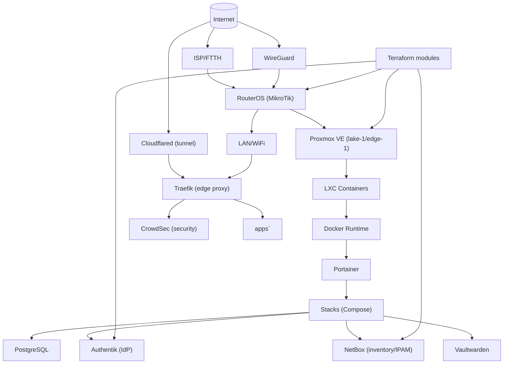

# 📚 Docs

This directory is where I keep the “why” and the “how”, not just the raw configs.

### What lives here

- **Golden paths** (`docs/golden-paths/`): the recommended way to do common changes in this repo.
- **Runbooks** (`docs/runbooks/`): incident/triage docs (“it’s on fire, now what?”).
- **Playbooks** (`docs/playbooks/`): repeatable ops tasks (“do X safely, step-by-step”).
- **ADRs** (`docs/adr/`): short decision records that explain *why* I picked approach A over B.

---

## C4 Container view

This is a C4-style “container view” of the homelab stack. It’s intentionally high level: major runtime pieces + how they talk.

---

## Conventions

- Keep docs small and useful. If it’s too long for someone to follow at 2AM, it’s probably missing a runbook/playbook split.
- Prefer links to actual repo paths (`stacks/<name>/`, `terraform/<module>/`) over copy-pasting giant configs.

