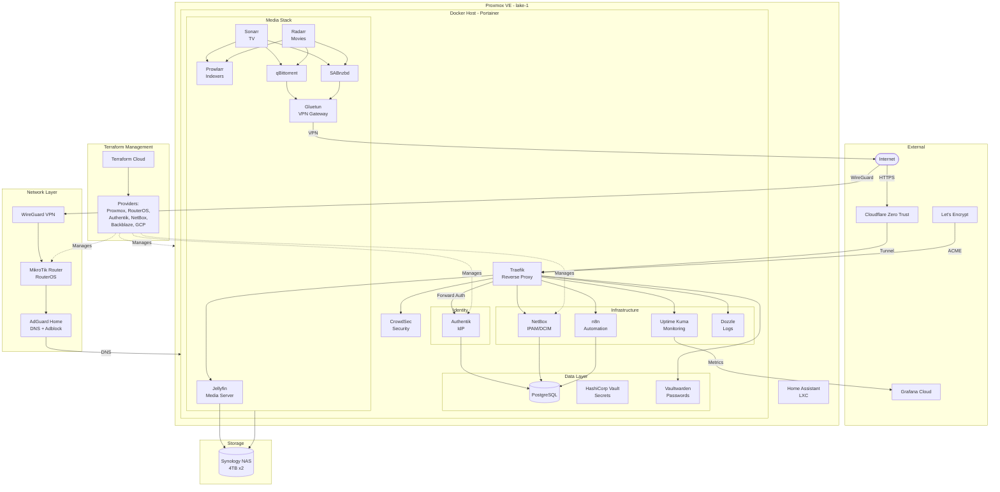

# C4 Container Diagram

This diagram shows the major containers (applications/services) in the home lab infrastructure and how they communicate.

## Overview Diagram



## Component Descriptions

### Edge Layer

| Component | Purpose | Managed By |
|-----------|---------|------------|
| **Cloudflare Zero Trust** | Secure tunnel for external access without exposing ports | Cloudflare dashboard |
| **Traefik** | Reverse proxy, SSL termination, routing | `stacks/traefik/` |
| **CrowdSec** | Threat detection and blocking | `stacks/traefik/` |
| **WireGuard** | VPN for direct access when needed | RouterOS |

### Identity & Security

| Component | Purpose | Managed By |
|-----------|---------|------------|
| **Authentik** | Single sign-on, OAuth/OIDC, LDAP | `stacks/authentik/`, `terraform/authentik/` |
| **Vault** | Secrets management | `stacks/vault/` |
| **Vaultwarden** | Password manager (Bitwarden API) | `stacks/vaultwarden/` |

### Data Layer

| Component | Purpose | Managed By |
|-----------|---------|------------|
| **PostgreSQL** | Shared database for Authentik, NetBox, n8n | `stacks/postgres/` |
| **Synology NAS** | File storage, backups, media | `terraform/synology-nas/` |

### Infrastructure Services

| Component | Purpose | Managed By |
|-----------|---------|------------|
| **NetBox** | IPAM, DCIM, inventory | `stacks/netbox/`, `terraform/netbox/` |
| **Uptime Kuma** | Availability monitoring | `stacks/uptime_kuma/` |
| **n8n** | Workflow automation | `stacks/n8n/` |
| **Dozzle** | Container log viewer | `stacks/dozzle/` |
| **AdGuard Home** | DNS server, ad blocking | LXC container |

### Media Stack

| Component | Purpose | Managed By |
|-----------|---------|------------|
| **Jellyfin** | Media server | `stacks/mediabox/` |
| **Sonarr/Radarr** | TV/Movie automation | `stacks/mediabox/` |
| **Prowlarr** | Indexer management | `stacks/mediabox/` |
| **Gluetun** | VPN gateway for downloaders | `stacks/mediabox/` |
| **qBittorrent/SABnzbd** | Download clients | `stacks/mediabox/` |

### Network Layer

| Component | Purpose | Managed By |
|-----------|---------|------------|
| **MikroTik Router** | Routing, firewall, DHCP, NTP | `terraform/routeros/` |
| **TP-Link Deco** | Wireless mesh | Manual |

## Data Flows

### External Access Flow

```
User → Cloudflare → Cloudflare Tunnel → Traefik → Service
                                           ↓
                                    (Optional: Authentik forward auth)
```

### Media Request Flow

```
User → Jellyseerr → Sonarr/Radarr → Prowlarr → Indexers
                         ↓
              qBittorrent/SABnzbd → Gluetun → VPN → Internet
                         ↓
                   Synology NAS
                         ↓
                     Jellyfin → User
```

### Terraform Management Flow

```
terraform/
    ├── terraform-cloud/  → Manages workspaces
    ├── proxmox/          → Manages VMs/LXCs
    ├── routeros/         → Manages router config
    ├── authentik/        → Manages IdP config
    ├── netbox/           → Manages inventory
    ├── portainer/        → Syncs stacks to host
    └── ...
```

