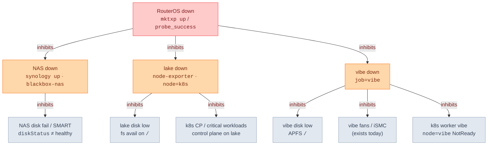

# Host alert dependencies (anti-domino)

Goal: one root-cause page when infra falls over — not NAS + lake + vibe + k8s worker + workloads all at once.

Status: draft (cascade model not locked). Recommended: **strict tree**.

## Inhibition tree

Arrow = parent firing **inhibits** child (child stays quiet).

## Anti-domino rules

1. **Highest ancestor wins.** RouterOS dies → page RouterOS only. NAS / lake / vibe host-down stay silent.
2. **Host silences own symptoms.** Host down → no disk-low / fans / SMART / that host’s k8s-node alerts.
3. **Topology facts**
   - lake down → k8s control plane down (and often monitoring on lake too).
   - vibe down → k8s worker `node=vibe` down.
4. **Symptoms only when host still up.** Disk / fans need live scrapes from that host.

## Cascade model options

| | Model | Behavior |
|---|---|---|
| **A** | Strict tree (recommended) | Full diagram above. One page per outage root. |
| **B** | Host-only inhibit | No RouterOS umbrella. Hosts silence own symptoms only. RouterOS + hosts can all fire. |
| **C** | Page roots only | Phone only host-down + disk-fail. Fans + disk-low = soft notify. |

## Signals (existing scrape jobs)

| Alert | Signal |
|---|---|
| RouterOS down | `up{job="mktxp"}` and/or `probe_success{job="blackbox-router"}` |
| NAS down | `up{job="synology"}` and/or `probe_success{job="blackbox-nas"}` |
| NAS disk fail | `diskStatus` / `diskHealthStatus` (SNMP) |
| lake down | `up{job="node-exporter",node="k8s"}` |
| lake disk low | `node_filesystem_avail_bytes` on `/` |
| vibe down | `up{job="vibe"}` |
| vibe disk low | `node_filesystem_*{job="vibe",mountpoint="/"}` |
| vibe fans | existing `vibe-ismc` rules (duty &gt; 60%, iSMC silent) |
| k8s worker vibe | inhibit when vibe host down (no separate page if parent fires) |
| k8s CP / workloads | existing critical-workload rules; inhibit when lake (or RouterOS) down |

## Note on monitoring locality

lake hosts VictoriaMetrics / exporters. lake hard-down → many scrapes go dark. Prefer external or path-independent probes where possible for RouterOS + NAS UI (`blackbox-*`). Treat scrape `up==0` carefully when the scraper itself may be dead.
